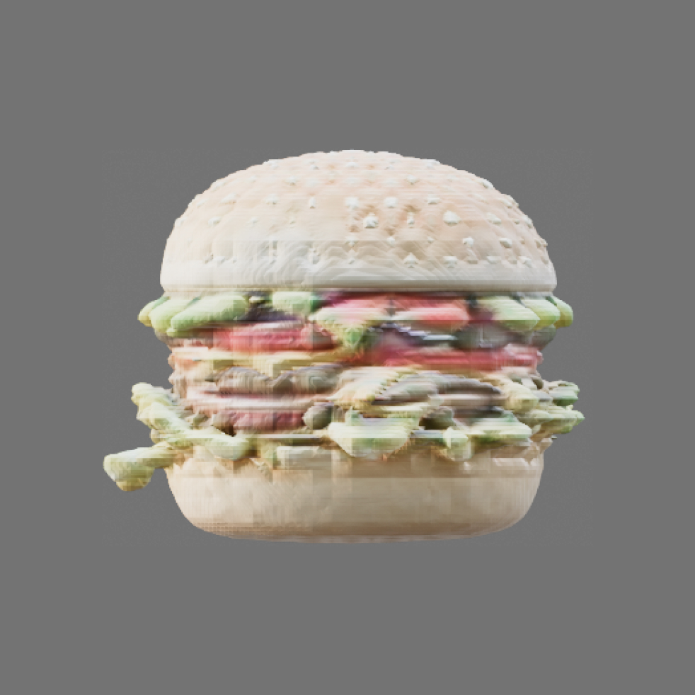

<p align="center">
  
</p>
<p align="center">
🟠 Generate 3D models using Gradio API directly from Blender
</p>

---

<p align="center">
  
  
</p>

### Features

- ⚙️ **Multiples Models**: Access different model pipelines for 3D model generation.
- ✨ **Prompt Enhancer**: Enhance the prompt for better results adapted to 3D generation.
- 🏭 **Batch Generation**: Generate multiples differents models in a row (if random seed enabled).
- 🔗 **Threading**: Run the model generation in a separate thread (to avoid the UI to freeze).

## Get started

### Installation

Download latest release in [releases page](https://github.com/greenmagenta/autosculptor/releases). Then, in Blender, go to `Preferences > Add-ons > Install` and select `autosculptor.py`. To activate it, check it in the add-on list.

This add-on integrate a built-in dependencies installer. At first use, it will ask the user the consent to install complementary dependencies. This step will require internet to download and install required packages. In case of error, or for manual dependencies installation, please refer to [troubleshooting dependencies](#dependencies) section.

### Usage

After installation, Autosculptor is available in Blender on `View3D > Sidebar > Autosculptor`. Please note that this add-on require internet to execute API requests.

| Input | Type | Description |
|---|---|---|
| Prompt | String | The text prompt describing the 3D model to generate |
| Model | Select | Model pipeline to use for generation |
| Prompt Enhancer | Boolean | Enhance the prompt for better results |
| Seed | Integer | Seed for generation |
| Random Seed | Boolean | Use a random seed for each generation |
| Guidance Scale | Integer | Scale for the guidance during generation |
| Inference Steps | Integer | Number of inference steps for generation |
| Apply Material | Boolean | Apply material to the generated model |
| Run in Thread | Boolean | Run the model generation in a separate thread |
| Batch Count | Integer | Number of 3D models to generate |

## Troubleshooting

### Dependencies

This addon the use third-party Gradio Python module. If a dependency error still occurs after complete installation, please try to reinstall Gradio module.

In Blender [Python console](https://docs.blender.org/manual/en/latest/editors/python_console.html):
```py
>>> import sys
>>> sys.exec_prefix
'/path/to/blender/python'
```
Then in a shell (running as administrator on Windows):
```bash
# change the working directory to Blender python bin path
$ cd /path/to/blender/python/bin

# check if pip is installed
$ ./python -m ensurepip

# uninstall Gradio module (if applicable)
$ ./python -m pip uninstall gradio_client

# install Gradio module
$ ./python -m pip install gradio_client
```
If you still have trouble installing Gradio to Blender python, please check [this StackExchange thread](https://blender.stackexchange.com/questions/5287/using-3rd-party-python-modules).

### APIs

Please note that services availability cannot be guaranteed at all times. This add-on relies entirely on community APIs, operated through Gradio clients. These APIs are hosted on [Hugging Face](https://huggingface.co/) and are therefore subject to the vagaries of (rare) outages. You can find out more about the [status of services](https://status.huggingface.co/) on their own page.

In addition, some Spaces on which APIs are hosted can also be paused or put on standby at any time. To manually check the status of an individual service, please refer to the [list of API hosts](#available-models).

## Available models

| Model | Pipeline Details | API Host(s) | Average generation time |
|---|---|---|---|
| Shap-E | [Shap-E](https://github.com/openai/shap-e) (mesh) | [hysts/Shap-E](https://huggingface.co/spaces/hysts/Shap-E) | ~13s |
| SDXL + Shap-E | [SDXL](https://huggingface.co/stabilityai/stable-diffusion-xl-base-1.0) (image) > [One-2-3-45](https://github.com/One-2-3-45/One-2-3-45) (preprocess) > [Shap-E](https://github.com/openai/shap-e) (mesh) | [hysts/SDXL](https://huggingface.co/spaces/hysts/SDXL), [hysts/Shap-E](https://huggingface.co/spaces/hysts/Shap-E), [One-2-3-45/One-2-3-45](https://huggingface.co/spaces/One-2-3-45/One-2-3-45) | ~30s |
| SDXL + DreamGaussian | [SDXL](https://huggingface.co/stabilityai/stable-diffusion-xl-base-1.0) (image) > [One-2-3-45](https://github.com/One-2-3-45/One-2-3-45) (elevation estimation) > [DreamGaussian](https://github.com/dreamgaussian/dreamgaussian) (mesh) | [hysts/SDXL](https://huggingface.co/spaces/hysts/SDXL), [jiawei011/dreamgaussian](https://huggingface.co/spaces/jiawei011/dreamgaussian), [One-2-3-45/One-2-3-45](https://huggingface.co/spaces/One-2-3-45/One-2-3-45) | ~600s |
| SDXL + InstantMesh | [SDXL](https://huggingface.co/stabilityai/stable-diffusion-xl-base-1.0) (image) > [InstantMesh](https://github.com/TencentARC/InstantMesh) (mesh) | [hysts/SDXL](https://huggingface.co/spaces/hysts/SDXL), [TencentARC/InstantMesh](https://huggingface.co/spaces/TencentARC/InstantMesh) | ~60s |
| SDXL + TripoSR | [SDXL](https://huggingface.co/stabilityai/stable-diffusion-xl-base-1.0) (image) > [TripoSR](https://github.com/VAST-AI-Research/TripoSR) (mesh) | [hysts/SDXL](https://huggingface.co/spaces/hysts/SDXL), [stabilityai/TripoSR](https://huggingface.co/spaces/stabilityai/TripoSR) | ~30s |

### Examples

| Shap-E | SDXL + Shape-E | SDXL + DreamGaussian | SDXL + InstantMesh | SDXL + TripoSR |
|---|---|---|---|---|
|  |  |  |  |  |
| `A pinguin, 3d model` |||||
|  |  |  |  |  |
| `A hamburger, 3d model` |||||

### Prompt Enhancer

Prompt enhancer requests [gustavosta/magicprompt-stable-diffusion](https://gustavosta-magicprompt-stable-diffusion.hf.space/) for generating an extended prompt more adapted to 3D model generation. Please note that Prompt Enhancer can sometimes deviate slightly from its original subject.

| Prompt | Model | Standard | Prompt Enhanced |
|---|---|---|---|
| `A orange cat` | SDXL + InstantMesh |  |  |
| `A orange cat, photorealistic` | SDXL + InstantMesh |  |  |

## Implementations

Currently working on other implementations like :
- Adding image to Mesh option
- Updating displayed parameters on differents models
- Thinking about self hosting/using more stable hosted models
- Adding preset system
- Adding generation progressbar/estimated generation time (through Gradio Status ETA)

## License

This project is licensed under [GPL-3.0](https://github.com/greenmagenta/autosculptor/LICENSE/) License.

### Warning

Before using this addon, please be aware that different models used in this project may have their own specific licenses and usage terms. It is your responsibility to review and comply with the licenses of each model to ensure that your use case is permitted. Failure to do so may result in legal consequences. Always verify the licensing terms of the models you intend to use. This program is provided for educational and experimental purposes.
